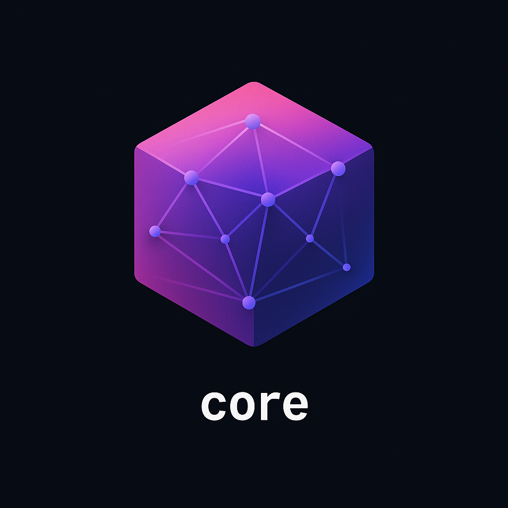

# Synergy Core Library

Core building blocks for Go services: context propagation, time utilities, structured logging, retries, IDs, caching, metrics, events, health checks, validation, and more. Stdlib-first, dependency-light, and adapter-friendly.

## Overview

- Small, composable packages you can adopt incrementally
- Clean, testable APIs with in-memory implementations for dev/tests
- Adapter-ready for popular ecosystems.

## What’s inside

- `chrono` (time): Testable time helpers (`Now`, `Since`, `FormatApprox`)
- `context`: Request metadata (trace/request/user/tenant/session) + safe logging fields
- `logging`: Thin `log/slog` wrapper with context injection; optional GELF handler
- `retry`: Context-aware retries with backoff policies and jitter
- `ids`: UUID v4 and ULID generation/validation; prefixed IDs
- `cache`: In-memory cache (TTL, sliding TTL, last-access, stats, `GetOrCompute`)
- `metrics`: Counter/Gauge/Histogram API; no-op default; in-memory registry; stopwatch
- `events`: Transport-agnostic pub/sub bus; in-memory implementation, per-sub retries
- `health`: Health check scaffolding (registry + checkers)
- `validation`: Declarative struct validation with extensible rules
- `entity`: Database-agnostic entity patterns with reflection support
- `utils`: Common utilities for string manipulation, reflection, and more

## Quick examples

### Context + Logging
```go
import (
  "context"
  ctxpkg "core/context"
  "core/logging"
  "log/slog"
  "os"
)

func main() {
  log := logging.NewJSON(os.Stderr, &slog.HandlerOptions{})
  logging.SetDefault(log)

  ctx, _ := ctxpkg.New(context.Background())
  ctx = ctxpkg.WithTenant(ctx, "tenant-1")
  ctx = ctxpkg.WithRequestID(ctx, "req-123")

  logging.Default().WithContext(ctx).Info("hello", "feature", "core")
}
```

### Retry with backoff
```go
import (
  "context"
  "errors"
  "core/retry"
  "time"
)

_ = retry.Do(context.Background(), func(ctx context.Context) error {
  return errors.New("transient")
}, retry.WithMaxAttempts(3), retry.WithPolicy(retry.Exponential(100*time.Millisecond, 2)))
```

### Cache with sliding TTL
```go
import (
  "context"
  "time"
  "core/cache"
)

c := cache.NewMemory(cache.WithDefaultTTL(5*time.Minute), cache.WithSlidingTTL())

defer c.Close()

val, _ := c.GetOrCompute(context.Background(), "user:42", 10*time.Minute, func(ctx context.Context) (any, error) {
  return 42, nil
})
_ = val
```

### Metrics stopwatch
```go
import (
  "core/metrics"
  inmem "core/metrics/inmem"
)

metrics.SetDefault(inmem.New())

sw := metrics.Start()
// ... work ...
sw.Stop("request_duration_seconds", metrics.Labels{"route":"/"}, nil)
```

### Events bus (in-memory)
```go
import (
  "context"
  "core/events"
)

bus := events.NewMemoryBus(events.WithBuffer(128), events.WithWorkers(2), events.WithAsync())
_, _ = bus.Subscribe("user.created", func(ctx context.Context, evt any) error { return nil }, events.WithRetries(3))
_ = bus.Publish(context.Background(), "user.created", map[string]any{"id":"42"})
```

## Package docs

- [`chrono`](./chrono/README.md)
- [`context`](./context/README.md)
- [`logging`](./logging/README.md)
- [`retry`](./retry/) — Go doc strings
- [`ids`](./ids/) — Go doc strings
- [`cache`](./cache/README.md)
- [`metrics`](./metrics/README.md)
- [`events`](./events/README.md)
- [`validation`](./validation/)
- [`entity`](./entity/)
- [`utils`](./utils/)

## Design principles

- Stdlib-first (slog, context)
- Small, explicit interfaces; zero magic
- In-memory defaults for tests/dev; adapters for production backends
- Easy to reason about; easy to remove

## Roadmap (adapters)

- Prometheus metrics registry
- OpenTelemetry metrics
- Kafka/NATS event bus adapters
- Health HTTP handler and built-in checkers 